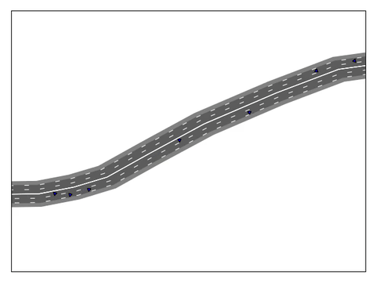

# SumoNetVis
A Python library for visualizing a Sumo network and trajectories with matplotlib.




Basic trajectory plotting from FCD outputs is built in, but it is also possible to plot custom data and graphics on
top of the network with the full flexibility and power of matplotlib and other compatible libraries, such as seaborn.

## Installation
This package can be installed via pip with the command ```pip install SumoNetVis```.
You can then import the library with:

```python
import SumoNetVis
```

### Dependencies
* shapely
* matplotlib
* numpy

## Usage
To plot a Sumo net file and trajectories, you can use the following code:

```python
import SumoNetVis
import matplotlib.pyplot as plt
# Plot Sumo Network
net = SumoNetVis.Net("path/to/yourfile.net.xml")
net.plot()
# Plot trajectories
trajectories = SumoNetVis.Trajectories("path/to/fcd-output.xml")
trajectories["vehicle_id"].assign_colors_speed()
trajectories["vehicle_id"].plot()
# Show figure
plt.show()
```

the Net.plot() function takes the following optional parameters:
* ax: matplotlib Axes object (defaults to currently active Axes)
* clip_to_limits: if True, only objects visible in the current view extents will be drawn
* zoom_to_extents: auto-zoom to Net extents (defaults to True)
* style: lane marking style to use ("USA" or "EUR")
* stripe_width_scale: scale factor for lane marking widths (defaults to 1)

### Animation
Instead of visualizing Trajectories as lines, an animation can be generated using the ```matplotlib.animation``` module.

```python
import matplotlib.animation as animation
trajectories = SumoNetVis.Trajectories("path/to/fcd-output.xml")
fig, ax = plt.subplots()
a = animation.FuncAnimation(fig, trajectories.plot_points, frames=trajectories.timestep_range(), repeat=False,
                            interval=1000*trajectories.timestep, fargs=(ax,), blit=True)
plt.show()
```

The plot settings for each vehicle can be customized and the color of each point can be animated, as shown in the
following example.

```python
for trajectory in trajectories:
        trajectory.assign_colors_speed()
        trajectory.point_plot_kwargs["ms"] = 8  # set marker size. Can set any kwargs taken by matplotlib.pyplot.plot().
```

In order to animate the color of the points based on the assigned color scheme, an additional farg must be passed
when creating the animation.

```python
a = animation.FuncAnimation(fig, trajectories.plot_points, frames=trajectories.timestep_range(), repeat=False,
                            interval=1000*trajectories.timestep, fargs=(ax, True), blit=True)
```

## Contribution
Issues and pull requests are welcome.
